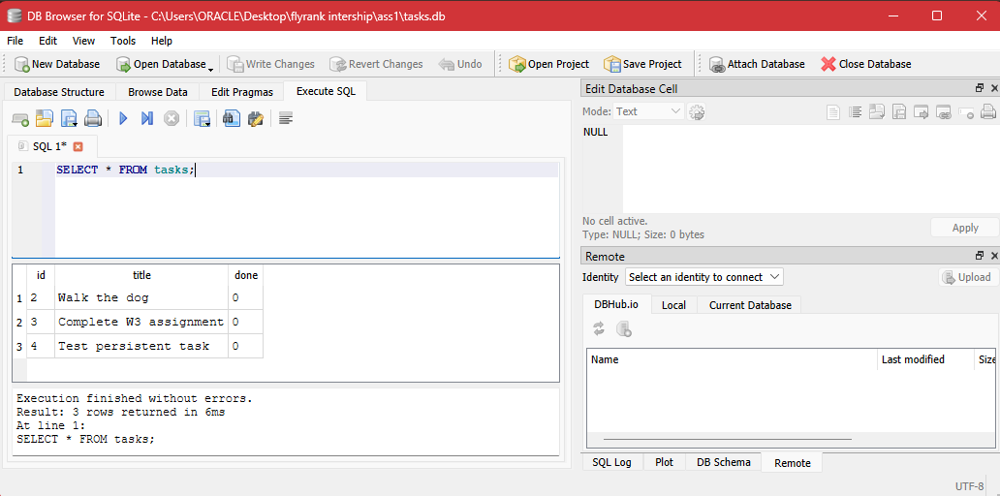

# Persistent Task Manager API (SQLite)

A RESTful CRUD API for managing tasks, built with **Node.js**, **Express**, and **SQLite** (`better-sqlite3`).

---

## Database Schema

The SQLite database (`tasks.db`) contains a single `tasks` table with the following schema:

| Field   | Type      | Details                     |
|---------|-----------|------------------------------|
| `id`    | `INTEGER` | Primary Key, Auto-increment  |
| `title` | `TEXT`    | Required                     |
| `done`  | `INTEGER` | `0` (false) or `1` (true)    |



---

## API Endpoints

| Method   | Endpoint      | Description               | Status Code                                     |
|----------|---------------|-----------------------------|--------------------------------------------------|
| `GET`    | `/tasks`      | Retrieve all tasks          | `200 OK`                                         |
| `GET`    | `/tasks/:id`  | Retrieve a task by ID       | `200 OK` / `404 Not Found`                       |
| `POST`   | `/tasks`      | Create a new task           | `201 Created` / `400 Bad Request`                |
| `PUT`    | `/tasks/:id`  | Update an existing task     | `200 OK` / `400 Bad Request` / `404 Not Found`   |
| `DELETE` | `/tasks/:id`  | Delete a task               | `204 No Content` / `404 Not Found`               |

---

## Setup & Running

1. **Install dependencies:**

   ```bash
   npm install
   ```

2. **Start the server:**

   ```bash
   node index.js
   ```

   The API will start listening on `http://localhost:3000`.
=======
# Task API — Express CRUD Service
 
A RESTful CRUD API for managing a to-do list, built with **Node.js** and **Express** as part of the **FlyRank Backend Track (Week 2 Assignment)**.
 
## Overview
 
This API manages an in-memory task collection using standard HTTP methods and proper status codes. Data resides in memory during runtime, and interactive visual documentation is served via Swagger UI.
 
---
 
## Features & Endpoints
 
| HTTP Method | Endpoint       | Description                              | Status Codes    |
|-------------|----------------|-------------------------------------------|------------------|
| `GET`       | `/`            | API metadata & route directory            | `200`            |
| `GET`       | `/health`      | Server health check                        | `200`            |
| `GET`       | `/tasks`       | List all tasks in memory                   | `200`            |
| `GET`       | `/tasks/:id`   | Get single task by ID                      | `200`, `404`     |
| `POST`      | `/tasks`       | Create a new task (with title validation)  | `201`, `400`     |
| `PUT`       | `/tasks/:id`   | Update task title or completed status      | `200`, `400`, `404` |
| `DELETE`    | `/tasks/:id`   | Remove a task by ID                        | `204`, `404`     |
 
---
 
## Getting Started
 
### Prerequisites
 
- [Node.js](https://nodejs.org/) (v16 or higher)
- [npm](https://www.npmjs.com/)
### Installation & Execution
 
1. **Clone the repository:**
```bash
   git clone https://github.com/Maryam-oss/a1-w2-crud-api.git
   cd a1-w2-crud-api
```
 
2. **Install dependencies:**
```bash
   npm install
```
 
3. **Start the server:**
```bash
   node index.js
```
 
   The API will start listening on `http://localhost:3000`.
 
---
 
## Sample Request & Response
 
### Creating a Task — `POST /tasks`
 
**Request:**
 
```bash
curl -i -X POST http://localhost:3000/tasks \
  -H "Content-Type: application/json" \
  -d '{"title": "Buy milk"}'
```
 
**Response:**
 
```
HTTP/1.1 201 Created
X-Powered-By: Express
Content-Type: application/json; charset=utf-8
Content-Length: 42
Date: Sat, 01 Aug 2026 10:00:00 GMT
Connection: keep-alive
 
{
  "id": 4,
  "title": "Buy milk",
  "done": false
}
```
 
---
 
## Interactive API Documentation
 
Interactive Swagger UI documentation is available directly through the browser while the server is active:
 
**http://localhost:3000/docs**

